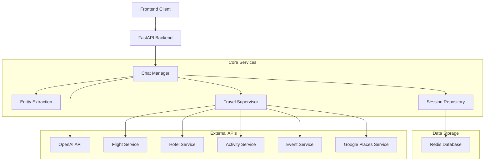
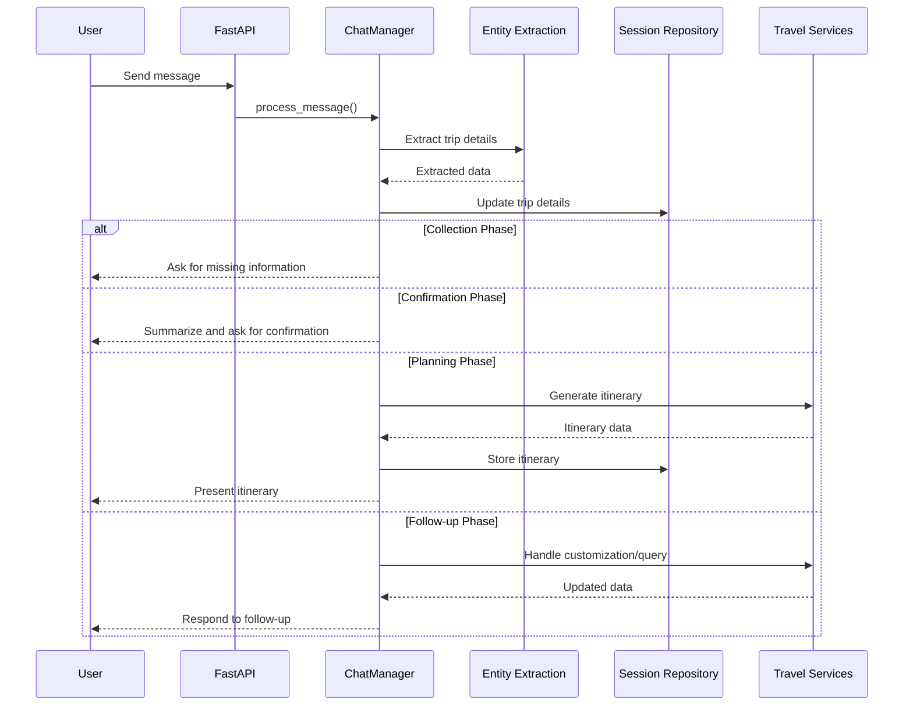

# Triptastic AI Travel Guide - Backend

## Overview

Triptastic AI Guide is an intelligent travel planning system that helps users plan detailed trips using AI-powered conversation and real-time travel data integration. This backend serves as the core API for the AI travel assistant, handling user sessions, trip planning, and integrations with various travel services.

## Architecture



## Core Components

### API Layer (FastAPI)

The API is built with FastAPI and provides the following endpoints:

- `/chat` - Process user messages and return AI responses
- `/chat/history/{session_id}` - Retrieve chat history for a session
- `/reset/{session_id}` - Reset a user session
- `/clear-user-sessions` - Clear all sessions for a specific user
- `/events/{destination}` - Get events for a specific destination
- `/places/{location}` - Search for places of interest
- `/attractions/{location}` - Search for attractions
- `/day-trips/{origin}` - Find potential day trips from an origin
- `/trip-cost/{session_id}` - Get cost breakdown for a trip

### Chat Manager

The ChatManager orchestrates the conversation flow by:

1. Processing user messages
2. Extracting trip details
3. Managing the conversation context
4. Generating responses using OpenAI
5. Creating itineraries
6. Handling follow-up questions

### Entity Extraction

The system extracts travel-related information from user messages, including:

- Origin and destination locations
- Travel dates
- Number of travelers
- Budget
- Activity preferences

### Travel Services

The system integrates with multiple travel-related services:

- **Flight Service**: Search for flights and prices
- **Hotel Service**: Search for accommodations with customization options
- **Activity Service**: Find activities and attractions at destinations
- **Event Service**: Discover events happening during the trip dates
- **Google Places Service**: Find detailed information about locations
- **Local Search Service**: Find restaurants and other amenities

### Data Storage

The system uses Redis for:

- Session management with TTL expiry
- Storing chat history
- Persisting trip details
- Caching itineraries and cost breakdowns

## Data Flow

1. User sends a message to the `/chat` endpoint
2. The ChatManager processes the message and extracts trip details
3. Based on conversation state and extracted data, the system:
   - Collects missing required trip information
   - Confirms trip details with the user
   - Generates itineraries using the TravelSupervisor
   - Handles follow-up questions and customization requests
4. The response is returned to the client with:
   - AI-generated message
   - Updated trip details

## Workflow Phases



## Key Features

- **Contextual Conversation**: Maintains conversation context to avoid asking redundant questions
- **Data Extraction**: Intelligently extracts travel details from natural language
- **Itinerary Generation**: Creates detailed day-by-day travel plans
- **Hotel Customization**: Allows users to specify preferences for accommodations
- **Budget Breakdown**: Provides cost estimates for different aspects of the trip
- **Follow-up Handling**: Responds to questions about generated itineraries

## Technical Stack

- **Framework**: FastAPI
- **Database**: Redis
- **AI**: OpenAI API
- **External APIs**: Various travel data providers
- **Session Management**: Custom Redis-based session handling
- **Deployment**: Docker/Kubernetes ready

## Getting Started

### Prerequisites

- Python 3.8+
- Redis server
- OpenAI API key

### Installation

1. Clone the repository
2. Install dependencies:
   ```
   pip install -r requirements.txt
   ```
3. Set up environment variables (see `.env.example`)
4. Run the server:
   ```
   uvicorn main:app --reload
   ```

### Environment Variables

The following environment variables are required:

- `OPENAI_API_KEY` - Your OpenAI API key
- `REDIS_HOST` - Redis server host
- `REDIS_PORT` - Redis server port
- `REDIS_PASSWORD` - Redis password (if applicable)
- `LOG_LEVEL` - Logging level (INFO, DEBUG, etc.)

## Development

### Project Structure

```
backend/
├── config/              # Configuration settings
├── managers/            # Business logic orchestration
│   ├── chat_manager.py  # Conversation management
│   └── assistants_manager.py
├── models/              # Data models
│   ├── chat_models.py   # API request/response models
│   └── trip_details.py  # Trip data structure
├── repositories/        # Data access layer
│   └── session_repository.py  # Redis interaction
├── services/            # Core services
│   ├── travel/          # Travel-related services
│   ├── extraction/      # Entity extraction
│   ├── customizers/     # Preference customization
│   └── supervisors/     # Orchestration logic
├── utils/               # Utility functions
├── main.py              # FastAPI application
├── app.py               # Streamlit frontend (optional)
└── requirements.txt     # Dependencies
```

### Adding New Features

1. Create any new models in the `models/` directory
2. Implement service logic in the appropriate service class
3. Update the ChatManager if needed for new conversation flows
4. Add API endpoints in `main.py`

## API Documentation

When running the server, visit `/docs` for the Swagger UI API documentation.
